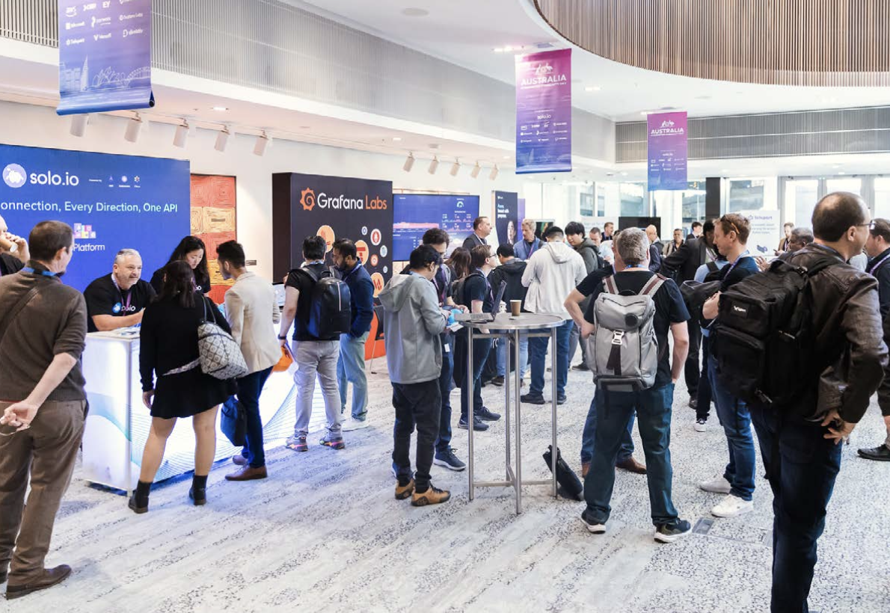

---
hide:
  - toc
  - navigation
---

# CloudCon Sydney 2025

Don’t miss CloudCon Sydney – happening 9–10 September 2025!

This premier cloud native event brings together global visionaries and local innovators for two days of hands-on learning, collaboration, and insight.

Connect directly with leaders from Kubernetes and other cutting-edge projects, explore beginner and advanced tracks, and help shape the future of cloud native in Australia.

Half international speakers, half local experts – 100% unmissable.

Our program delves into critical themes of Kubernetes, AI & ML, Platform Engineering, and Security, making it an essential event for various roles across a wide range of organizations.  

## Questions?

Please contact the organisers via email: `organizers@kcdaustralia.onmicrosoft.com`